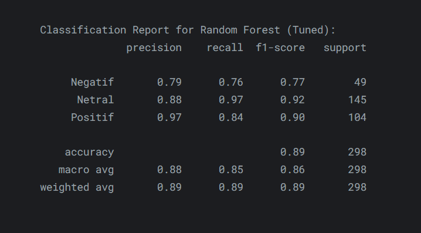

<h2>⭐️ Akademi Crypto App Sentiment Analysis</h2>

 

## Overview

To find out the sentiment of the users of the "Akademi Crypto" app, I conducted a sentiment analysis of user reviews with data from the Google Playstore. With the help of various visualizations such as WordCloud, Donut Plot, Bar Chart, and others, useful insights can be displayed for app developers.

## Project Link

[Click here](https://www.kaggle.com/code/rfldmr/akademi-crypto-app-sentiment-analysis) to take you to Kaggle website.

## Tech Stack

- **Python**: A versatile programming language used extensively in web development, data science, and AI.
- **NLTK**: A Python library for natural language processing tasks, offering tools for text analysis and understanding.
- **Scikit-learn**: A popular Python machine learning library providing various algorithms, including Random Forest and Gradient Boosting.
- **Random Forest**: An ensemble learning method that combines multiple decision trees for improved prediction accuracy.
- **VaderSentiment**: A tool for sentiment analysis, determining the emotional tone of text.
- **GitHub**: A platform for collaborative software development, hosting, and version control.
  
## Dataset

[Click here](https://www.kaggle.com/datasets/rfldmr/akademi-crypto-app-google-playstore-review) or check the "Dataset" folder in the repository to access the dataset.

 

Credits to the original dataset owner:
- Rafli, D. (2025). Akademi Crypto App Google Playstore Review.

## Model Evaluation

## Reference

NAJWAPUTRIF. (2025). *Sentiment Analysis Review Aplikasi Gojek*. Kaggle. [Click here](https://www.kaggle.com/code/najwaputrif/sentiment-analysis-review-aplikasi-gojek/notebook)

## Copyright

© 2025 Rafli Damara.
